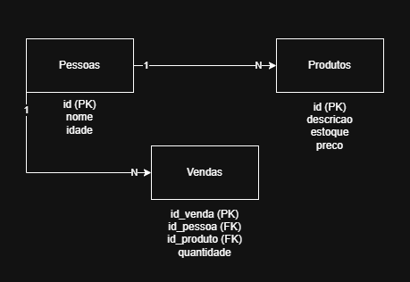

# Projeto: Banco de Dados - Diagrama ER

## 📋 Descrição

Este projeto consiste na modelagem de um banco de dados utilizando o Diagrama Entidade-Relacionamento (ER). O objetivo é representar as entidades, atributos e os relacionamentos de um sistema simples de vendas.

## 🛠️ Tecnologias Utilizadas

- MySQL / PostgreSQL (para modelagem física)
- Draw.io (para criação do diagrama ER)
- Google Colab (para notebooks Python)
- GitHub (para versionamento e colaboração)

## 🗂️ Estrutura do Banco de Dados

O banco de dados possui as seguintes entidades:

### 1️⃣ Pessoas
- `id` (PK)
- `nome`
- `idade`

### 2️⃣ Produtos
- `id` (PK)
- `descricao`
- `estoque`
- `preco`

### 3️⃣ Vendas
- `id_venda` (PK)
- `id_pessoa` (FK)
- `id_produto` (FK)
- `quantidade`

### 📊 Relacionamentos

- Uma pessoa pode realizar várias vendas (1:N).
- Um produto pode estar relacionado a várias vendas (1:N).

## 🖼️ Diagrama ER



> **⚠️ Importante:**  
Substitua `caminho/para/imagem.png` pelo caminho real onde o diagrama está no repositório, exemplo:  
`imagens/diagrama-er.png` ou `docs/diagrama.png`.  

## 🚀 Como Executar

1. Clone este repositório:
   ```bash
   git clone https://github.com/seu-usuario/seu-repositorio.git
